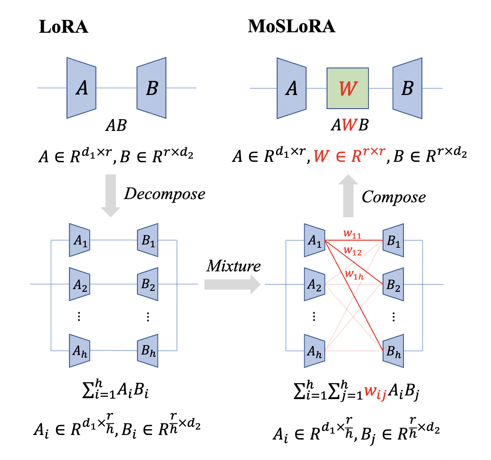

# Mixture-of-Subspaces in Low-Rank Adaptation

## Basic Information

Title: Mixture-of-Subspaces in Low-Rank Adaptation

Authors: [Taiqiang Wu](https://wutaiqiang.github.io/); [Jiahao Wang](https://scholar.google.com/citations?user=QjVR3UUAAAAJ&hl=zh-CN); Zhe Zhao; Ngai Wong

Link: https://arxiv.org/pdf/2406.11909 

TL, DR: We decompose LoRA into subspaces via structural re-parameterization and propose a simple yet effective MoSLoRA
method, employing a learnable mixer to fuse
more subspaces and more flexibly.


<p style="text-align: center">

</p>

## Quick Start

please follow the README in each folder to reproduce the results.

- [ ] TODO: try to insert MoSLoRA into peft package.


## Contact

Taiqiang Wu: takiwu@connect.hku.hk

## Citation

If you find MoSLoRA useful, please cite it by using the following BibTeX entry.

```
@article{wu2024moslora,
  title={Mixture-of-Subspaces in Low-Rank Adaptation},
  author={Taiqiang Wu and Jiahao Wang and Zhe Zhao and Ngai Wong},
  booktitle={arXiv:2406.11909},
  url={arxiv.org/abs/2406.11909},
  year={2024}
}
```